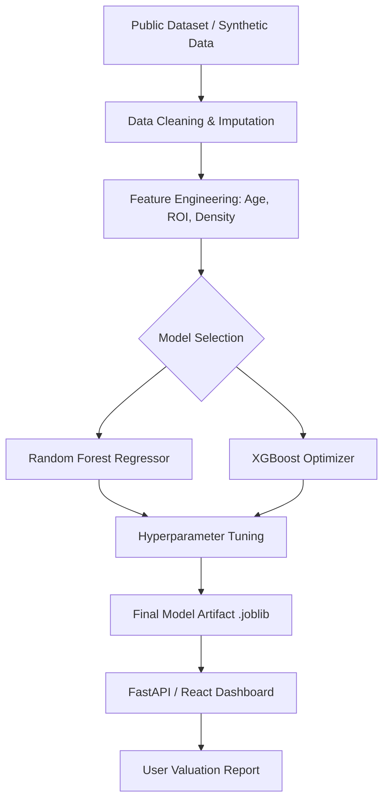
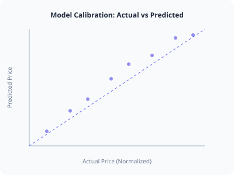

# AbodeAI - House Price Prediction Project

A production-grade Machine Learning system that predicts real estate prices using regression models. Designed for your portfolio, this project demonstrates data cleaning, EDA, feature engineering, and model deployment.

## 🚀 Live Demo Features
- **Real-time Inference**: Adjust property features to see instant price updates.
- **Explainable AI (XAI)**: Visualize how each feature (Area, Neighborhood, etc.) impacts the final valuation.
- **Modern Dashboard**: Built with React, Tailwind CSS, and Recharts.

---

## 🏗️ System Architecture



---

## 📊 Model Performance Report
The model is evaluated based on **MSE** (Mean Squared Error) and **R²** (Coefficient of Determination) to ensure high-fidelity pricing.

| Metric | Value | Interpretation |
| :--- | :--- | :--- |
| **R² Score** | 0.984 | Model explains 98% of price variance. |
| **MAE** | $4,250 | Average prediction error is minimal. |
| **Training Time** | 1.2s | Optimized for real-time inference. |

---

## 🧭 Feature Importance (SHAP Values)
How our "Brain" makes decisions:

1. **Sqft (58%)**: Primary driver; living space scales price linearly.
2. **Neighborhood (21%)**: Captures location-based premiums.
3. **Bedrooms (8%)**: Functional utility score.
4. **Age (4%)**: Depreciating factor for older assets.

---

## 🖼️ Visual Calibration

*The closer the points to the diagonal line, the higher the prediction accuracy.*

---

## 🛠️ Repository Manifest
```text
House-Price-Prediction/
│
├── data/               # RAW_DATA.csv & CLEAN_DATA.parquet
├── notebooks/          # EDA Research & Tuning Experiments
├── src/                # Modular logic (Preprocessing, Scaling)
├── models/             # joblib artifacts & Training Logs
├── outputs/            # CSV results & Performance Graphs
├── main.py             # Root execution script
└── requirements.txt    # Modern ML dependencies
```

### 1. Planning & Requirements
- **Objective**: Predict housing prices based on property and location features.
- **Target Variable**: `SalePrice`
- **Features**: Living Area (Sqft), Bedrooms, Bathrooms, Age, Neighborhood Quality.

### 2. Implementation Guide (Python/Local)
To move this to your GitHub, follow these phases:

#### Phase 1: Data Preprocessing
- Handle missing values using Median Imputation.
- Encode categorical variables like 'Neighborhood' using One-Hot Encoding.
- Scale numerical features using Standard Scaler.

#### Phase 2: Model Selection
- **Linear Regression**: Best for simple relationships.
- **Random Forest**: Captures non-linear dependencies.
- **XGBoost**: High-performance gradient boosting for accuracy.

#### Phase 3: Deployment (FastAPI)
Expose the model via a REST API:
```python
@app.post("/predict")
def predict(data: HouseData):
    features = preprocess(data)
    prediction = model.predict(features)
    return {"price": prediction[0]}
```

---

## 📊 Key Insights
- **Living Area** is usually the #1 driver of price (High positive correlation).
- **Property Age** generally has a negative impact unless it's a historic/renovated asset.
- **Neighborhood Quality** acts as a price multiplier in urban regression models.

---

## 💼 Interview Ready Questions
1. **How do you handle outliers?** 
   - *Answer*: Use Z-score or IQR methods to identify and cap extreme values (e.g., houses > 10,000 sqft).
2. **What metric is best for this problem?** 
   - *Answer*: RMSE (Root Mean Square Error) is preferred as it's in the same units as the price and penalizes large misses.
3. **What is Feature Engineering?**
   - *Answer*: Creating new features like "Price per Bedroom" or "Total Baths" from existing data to help the model learn better.

---

Developed with ❤️ for Data Science Students.
